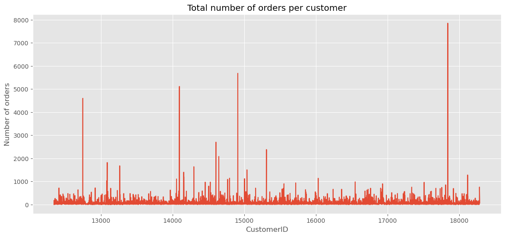
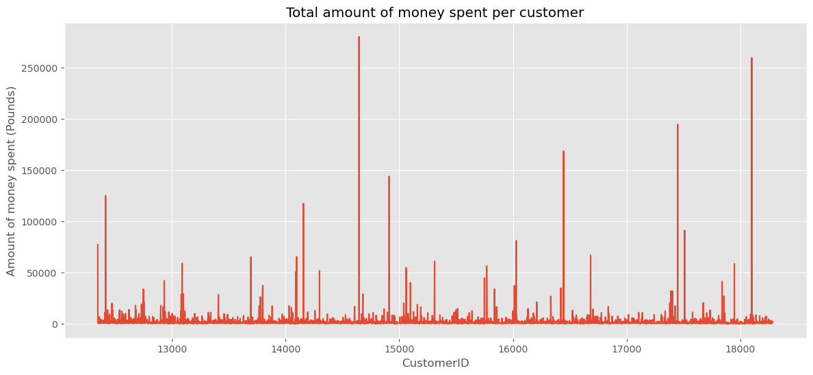
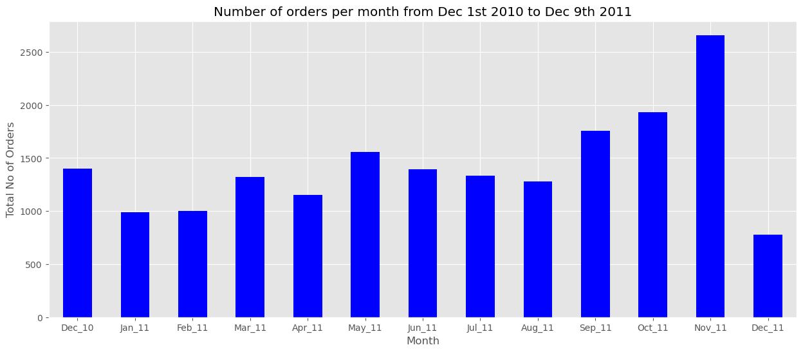
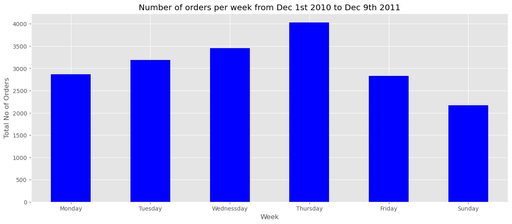
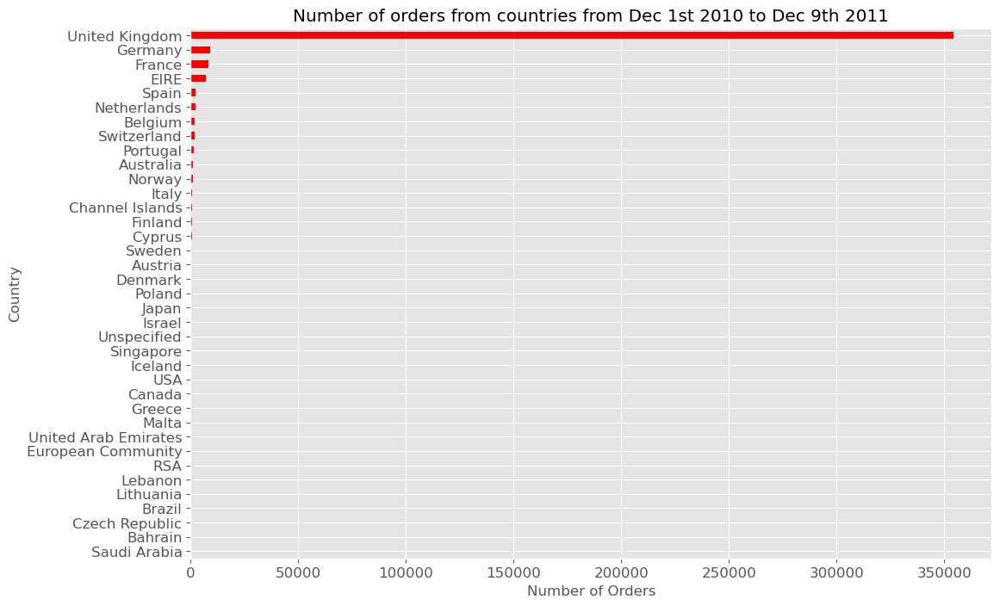
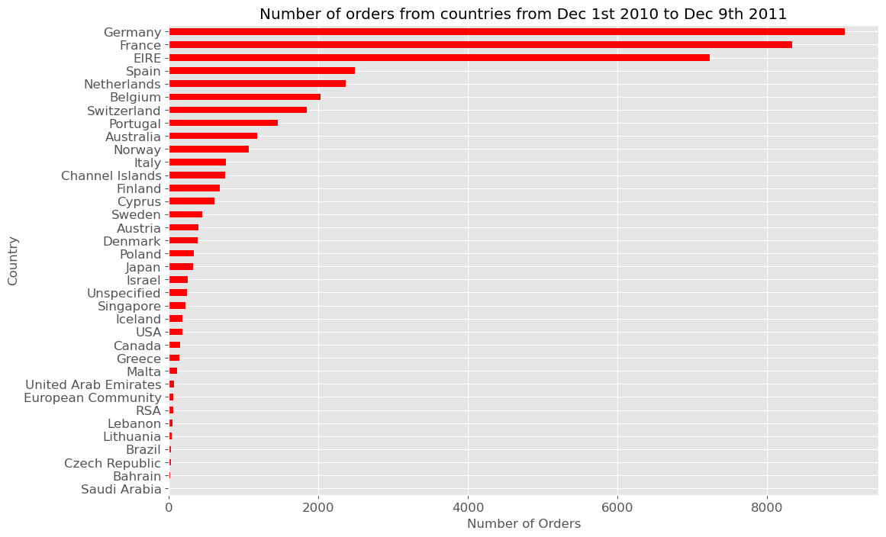
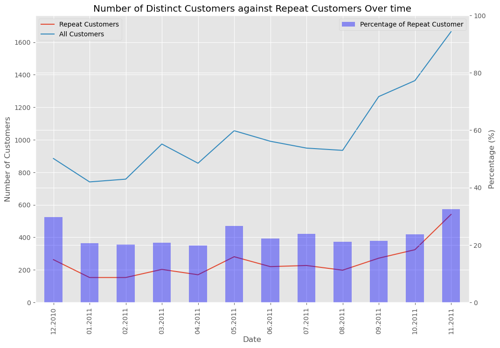
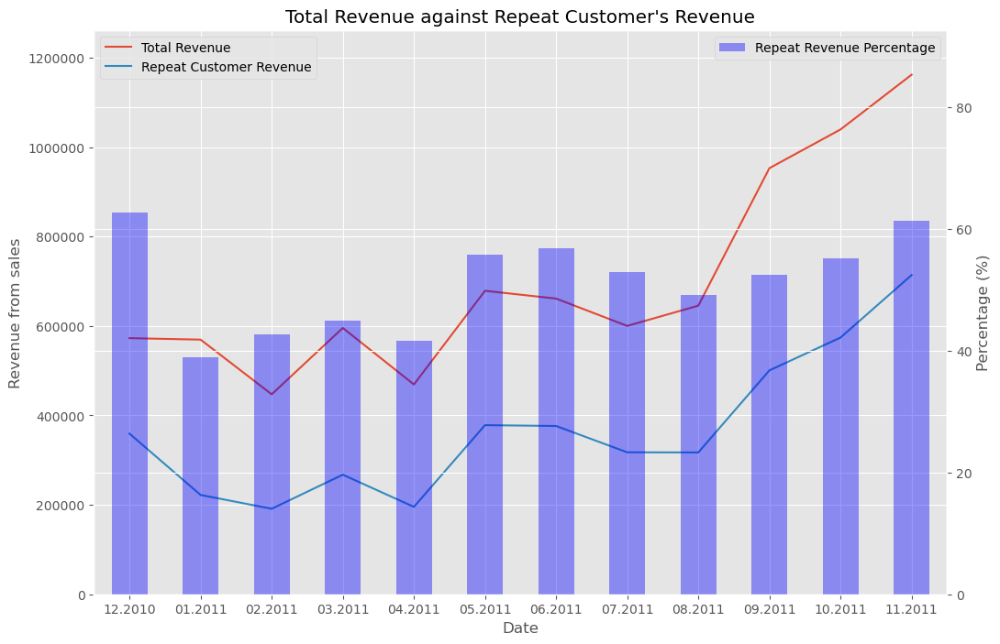
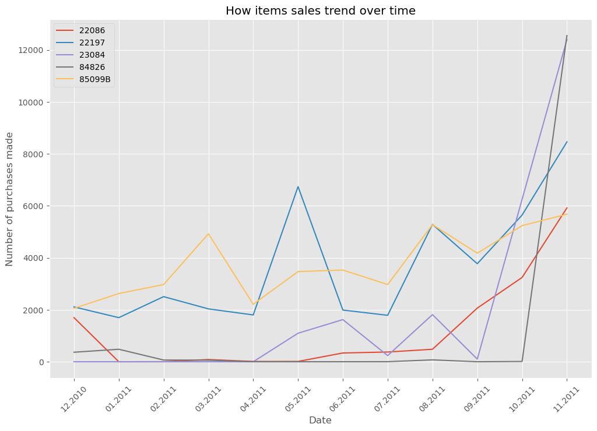

# Ecommerse-Store-Analysis

There has been an increase in the trend of online sales and e-commerce stores over the years. Many local retail stores are now having an online presence. It is quite easy these days to own a retail store online and not hold any physical product. This is thanks to the influence of big e-commerce stores like Amazon, Aliexpress, Alibaba, Shopify, etc. Through these platforms, you can dropship products from them and host them on your e-commerce store.

Despite how easy it is to own an e-commerce store now; it is imperative to track your sales and website conversions to optimize your business. Data analysis has been playing a crucial role when it comes to optimizing business operations and maximizing profits. 
In this project, I analyzed E-commerce store data to uncover some important business insights.

## DATA SOURCE

The data was gotten from [Kaggle](https://www.kaggle.com/datasets/carrie1/ecommerce-data)

## DATA CLEANING AND EXPLORATION

* The dataset was loaded into Jupyter notebook using pandas.
* All null values are dropped.
* CustomerID was converted to int datatype.
* All rows with negative quantity sold were removed.
* InvoiceDate was converted to DateTime datatype and used to extract different date-time columns

## DATA ANALYSIS

The dataset was grouped according to customer, country, and amount spent. The insight derived from this grouping are:

Total number of orders per customer

Total amount spent per customer

### Purchase pattern analysis

The purchase pattern of customers in the store was analyzed. We uncovered the following:

Number of orders per month from Dec 1st, 2010 to Dec 9th, 2011 (November 2011 has the highest number of orders out of the months)

Number of orders per week from Dec 1st, 2010 to Dec 9th, 2011 (Thursdays generated the highest sales within the given period)

### COUNTRY ANALYSIS

The stores’ sales were also analyzed to determine which country generated more sales for the country.

Findings:

Number of orders from countries from Dec 1st, 2010 to Dec 9th, 2011 (the United Kingdom generated the highest sales. This is because the store is based in the United Kingdom)

If the United Kingdom is removed from the dataset, the highest sales come from Germany followed by France.

Amount of Money from countries (No UK) from Dec 1st 2010 to Dec 9th 2011 – The largest revenue of the store is coming from the Netherlands followed by Ireland and Germany

### CUSTOMER ANALYSIS

We determine the number of distinct customers and repeat customers and the percentage of repeat customers patronizing the store from our dataset.

It was deduced that toward the end of 2011, the percentage of repeat customers increased. Likewise, the percentage of repeat customers keeps increasing over time.

Likewise, the percentage revenue gotten from repeat customers is always around 50% revenue of the store and both the total revenue and revenue from repeat customers keep increasing over time in the store.

### PRODUCT ANALYSIS

Another analysis was done to determine the top five selling products in November 2011. The top five product sales trends were now analyzed from December 2010. It was discovered that all five products saw an exponential increase in sales from October 2011 to November 2011

